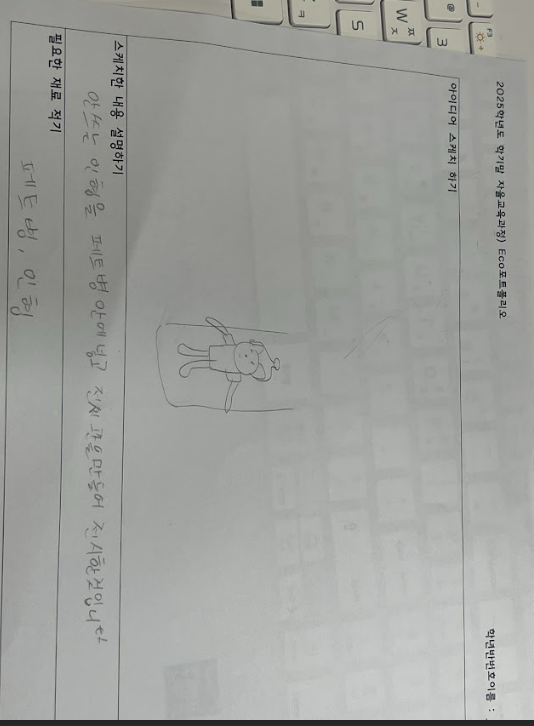
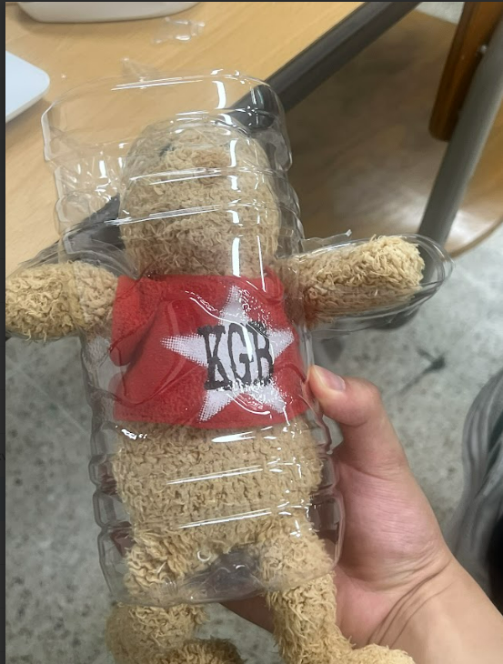

# 🌱 에코아트 프로젝트: [작품명]

## 📖 프로젝트 개요
- **제작자**: [이상민]
- **제작일**: [2025.07.16]
- **소개**
> 우리 작품이 어떤 환경 문제를 다루고 있는지, 어떤 메시지를 전달하고 싶은지 자유롭게 설명해주세요.
> (버려진 페트병이 동물들에게 피해를 주고있다는 것을 설명하기 위하여 이런 작품을 만들게 됬습니다.)

## 📦 사용 재료
- 아두이노, 온도센서, LED, 브레드보드
- 페트병,곰인형, 그림 도안 등

## 🔧 제작 과정

### 1단계: 아이디어 스케치

- 아이디어 설명
- 예상 완성도

### 2단계: 완성품

## 💭 제작 후기
### 잘된 점
- 생각한 그대로는 아니였지만 그래도 머리에서 그리던 작품과 비슷하게 나와 기분은 뿌듯했다

### 아쉬운 점

-더 잘만들수 있었는데 너무 허술해서 아쉬웠던것같다 

### 개선할 점

-조명위치가 아쉬웠고 다음에 이런 시간이 또 생긴다면 한번도 도전하고 싶은 생각 이있었다 

### 내가 이미 알고 있었던 것

-초등학생떄 아두이노에 대해 한번 만저본적있어서 오랜만에 만져봐서 좋았던것같다 

### 새롭게 배운게 된 것

- 아두이노를 활용해 전구를 깜빡이는걸 배웠서 좋았다 

### 더 알고 싶은 것

-어른이 되도 이런 활동을 계속하고 싶을만큼 흥미로운 활동이였고 앞으로 이런 기회가 많았으면 좋을것 같다 

## 🌍 환경적 의미
- 페트병 하나라도 쓰레기에서 작품이 되었다
- 쓰레기를 줄이고 작품이 된다
- 일회용품을 줄여보겠다

## 📚 참고 자료
- [환경 관련 웹사이트](https://www.me.go.kr/home/web/main.do)
- [참고한 에코아트 작품](링크)

## 🏷️ 태그
#에코아트 #재활용 #환경보호 #DIY #창의활동

---

> 이 프로젝트는 환경 보호와 창의적 사고를 위한 교육 목적으로 제작되었습니다
